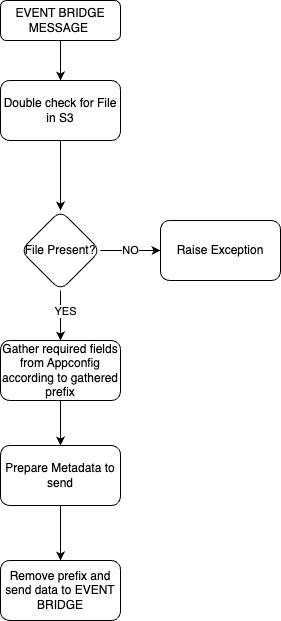

# woody_flipflop_parse_metadata_third_step_xml

This repository represents third step in gathering, extracting and
updating metadata in sonyhive api platform. Inputs might be coming 
from many sources so the key to the overhaul flow is to be adaptive.

## Installation
This repository i just a representation of Lambda function stored in
company AWS account. Every test should be run in AWS and be verified
in CloudWatch. Main function and a starting point of this step starts
with lambda.py, and it's handler() 

## Usage

### High level overview
Below we present high level overview of the algorithm for the Third
step.

<div align="center">
  
</div>

Third step purpose is to prepare metadata required for sending to 
hive api.

### Important configuration and environment variables

#### Prefixes:
Prefixes represent folders in S3 bucket that stores available metadata from many
sources. They also are used to direct event bridge. Bellow is the example of
prefixes configuration in AWS AppConfig:
```json
    [
      {
        "prefix-name": "source1-metadata",
        "file-format": ".xml"
      },
      {
        "prefix-name": "source2-metadata",
        "file-format": ".json"
      },
      {
        "prefix-name": "source3-metadata",
        "file-format": ".json"
      }
    ]
```

As we can see  the configuration is stored as a json file. Available prefix data
also stores format of file that is contained within S3 and directs the path of
EventBridge flow.
- IMPORTANT:
  - configuration of prefixes mus be strictly created in such manner as in example above.
  - before considering adding another source a porper configuration of prefixes must be created

#### Required Fields:
For this step it is important to gather required fields for hive api call from AppConfig.
Typical configuration stored in json file is presented bellow:
```json
[
  {
    "source-field": "workflow.user.name",
    "destination-field": "customMetadata.social_user_CHAR"
  },
  {
    "source-field": "sources.source.metadatas.metadata[@id='social_source_uri'].value",
    "destination-field": "customMetadata.social_source_uri_CHAR"
  },
  {
    "source-field": "sources.source.metadatas.metadata[@id='social_author'].value",
    "destination-field": "customMetadata.social_author_CHAR"
  },
  {
    "source-field": "sources.source.metadatas.metadata[@id='social_network'].value",
    "destination-field": "customMetadata.social_network_CHAR"
  },
  {
    "source-field": "sources.source.metadatas.metadata[@id='social_description'].value",
    "destination-field": "customMetadata.social_description_CHAR"
  },
  {
    "source-field": "sources.source.metadatas.metadata[@id='mm_source_name'].value",
    "destination-field": "name"
  }
]
```

- IMPORTANT
   - Configuration of required fields should be strict for parsing metadata from xml files. Key 'source-field' should represent the path to requested value in xml file.
   - Each tag name is separated by '.'
   - In key 'destination-field' each tag also is separated by '.' in the result json, for example
     - customMetadata.social_description_CHAR
     - ```{"customMetadata": {"social_description_CHAR": "Value"}}```

#### Environment Variables

EV for this step represent configurations id's and names:
	
Value
- APP_CONFIG_APP_ID
- APP_CONFIG_{PREFIX}_ID
- APP_ENVIRONMENT
- S3_BUCKET_NAME
